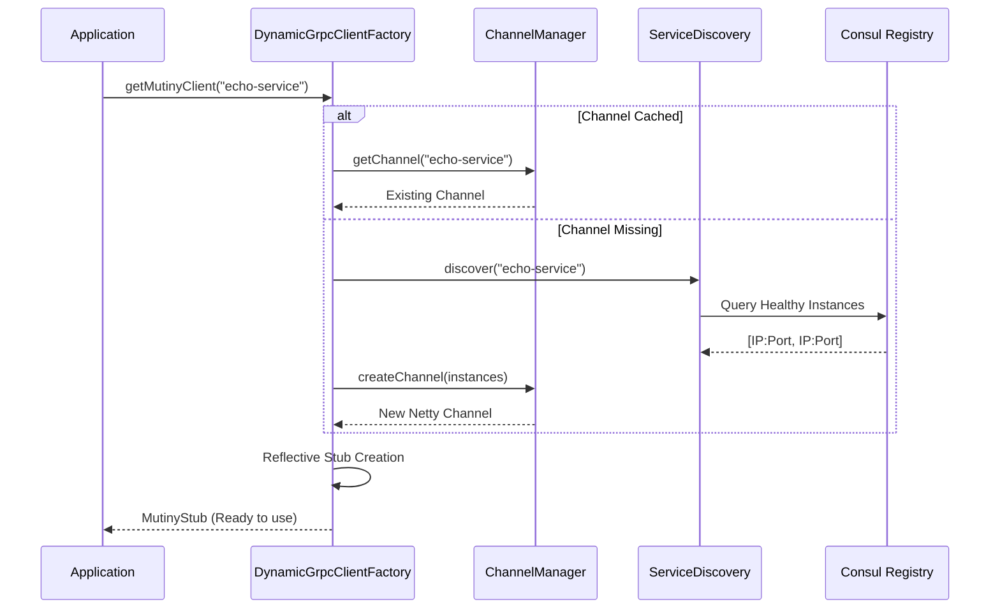

# Dynamic gRPC & Platform Features

The `platform-libraries/libraries/dynamic-grpc` module is a cornerstone of the Pipeline Engine's microservices architecture. It bridges the gap between static gRPC definitions and dynamic service discovery, while enforcing critical performance optimizations for high-throughput data processing.

## Core Architecture

The module provides a **Dynamic Client Factory** that abstracts away:
1.  **Service Discovery:** Finding service instances in Consul.
2.  **Load Balancing:** Distributing requests across instances.
3.  **Channel Management:** Caching and recycling gRPC channels.
4.  **Stub Creation:** Generating strongly-typed Mutiny clients on demand.

### High-Level Flow



---

## Key Components

### 1. Dynamic Client Factory (`DynamicGrpcClientFactory`)

This is the primary entry point for applications. It provides specific methods for common services and a generic method for any service.

**Usage:**
```java
@Inject
DynamicGrpcClientFactory clientFactory;

public Uni<Void> process(Request req) {
    // Get a client for the "chunker" service
    return clientFactory.getMutinyClientForService("chunker")
        .chain(client -> client.process(req));
}
```

### 2. Channel Manager (`ChannelManager`)

Handles the lifecycle of gRPC connections to avoid resource leaks and connection churn.

*   **Caching:** Uses Caffeine to cache channels based on service names.
*   **Eviction:** Automatically closes channels after a configurable idle TTL (default: 15 minutes).
*   **Shutdown:** Ensures graceful shutdown of channels during application termination.

**Configuration:**
```properties
pipeline.grpc.channel.idle-ttl-minutes=15
pipeline.grpc.channel.max-size=1000
pipeline.grpc.channel.shutdown-timeout-seconds=2
```

### 3. Service Discovery (`ServiceDiscoveryManager`)

Integrates directly with Consul to find healthy service instances.

*   **Direct Mode:** Bypasses static Stork configuration to allow services to register/deregister dynamically.
*   **Load Balancing:** Implements a `RandomLoadBalancer` to distribute traffic.
*   **Safety:** Throws clear exceptions if a service is not found or has no healthy instances.

---

## Advanced: Reflection-Based Client Generation

To keep the engine generic, the `GrpcClientProvider` uses Java reflection to instantiate clients. This means the engine doesn't need to know *compile-time* details about every possible service it might call.

**Mechanism:**
1.  Accepts a `Class<T>` representing the Mutiny stub (e.g., `MutinyPipeStepProcessorStub`).
2.  Identifies the enclosing gRPC class generated by `protoc`.
3.  Reflectively invokes the static `newMutinyStub(Channel)` method.

This allows `DynamicGrpcClientFactory` to return strongly-typed clients while maintaining a loose coupling with the underlying service definitions.

---

## Critical Performance Optimization

The default gRPC HTTP/2 flow control window (64KB) is **catastrophically small** for large data transfer, limiting throughput to ~5-10 MB/s. This library implements a comprehensive fix to unlock **300+ MB/s** throughput.

### The Problem: HTTP/2 Window Exhaustion

For a 250MB message:
1.  Sender transmits 64KB.
2.  Sender **stops** and waits for an ACK (WINDOW_UPDATE).
3.  Receiver processes and ACKs.
4.  Repeat ~4,000 times.

### The Solution: 100MB Window

We forcibly increase the flow control window to **100MB** on both client and server.

#### 1. Client-Side (`GrpcClientProvider`)
Automatically applies the window size to all created channels:
```java
NettyChannelBuilder.forAddress(host, port)
    .initialFlowControlWindow(104857600) // 100MB
    .build();
```

#### 2. Server-Side (`GrpcServerFlowControlCustomizer`)
Uses a `ServerBuilderCustomizer` to intercept the server startup and apply settings to the underlying Netty server.

**Constraint:** This **ONLY** works with the separate Netty server. The unified Vert.x HTTP server does not expose these hooks.

### Required Configuration

All services using this library **MUST** apply these settings in `application.properties` to benefit from high throughput:

```properties
# ------------------------------------------------------
# gRPC Performance Tuning (CRITICAL for Large Messages)
# ------------------------------------------------------

# 1. Enable Separate Server (REQUIRED)
# The unified server (false) does NOT support flow control tuning.
quarkus.grpc.server.use-separate-server=true

# 2. Tune Server Window (100MB)
quarkus.grpc.server.flow-control-window=104857600

# 3. Tune Client Window (100MB)
quarkus.grpc.clients."*".flow-control-window=104857600

# 4. Max Message Sizes (2GB)
quarkus.grpc.server.max-inbound-message-size=2147483647
quarkus.grpc.clients."*".max-inbound-message-size=2147483647
```

### Benchmark Results

| Scenario | Standard Config | Optimized Config | Improvement |
| :--- | :--- | :--- | :--- |
| 250MB Single Message | ~10 MB/s | **367 MB/s** | **36x** |
| 10MB x 10 Parallel | ~8 MB/s | **255 MB/s** | **31x** |

---

## Troubleshooting

### "Flow control window setting cannot be applied" Warning
*   **Cause:** `quarkus.grpc.server.use-separate-server` is set to `false` (or default).
*   **Fix:** Set it to `true`. The unified server cannot be optimized.

### Service Not Found
*   **Cause:** The service is not registered in Consul, or has failing health checks.
*   **Fix:** Check Consul UI (`http://localhost:8500`). Ensure the service name string matches exactly (e.g., "chunker" vs "module-chunker").

### Channel Leaks
*   **Symptoms:** Application memory usage grows over time; "Too many open files" errors.
*   **Fix:** Ensure `ChannelManager` is managing the channels. Do not create manual channels in application code unless you are managing their lifecycle explicitly.
